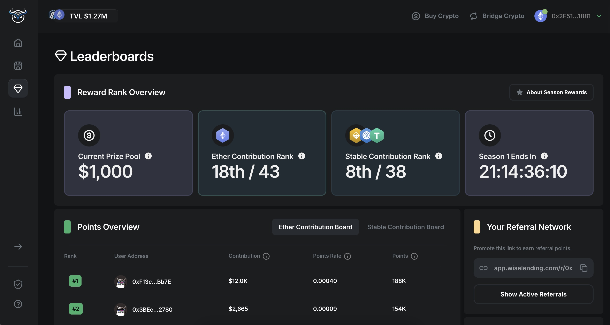
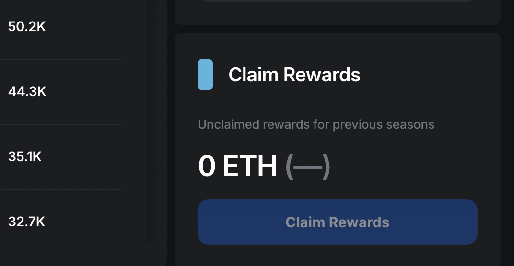

1. [💰Wise Lending](/wise/wise-lending)

# 💎Leaderboards

Our leaderboards are where we track and reward users' contribution to Wise Lending using a points system. The boards can be accessed by clicking the gem tab in the app, where you can toggle between the Ether and Stable Coin leaderboards. To start climbing ranks, simply deposit funds into Wise Lending. You can gain additional points by sharing your referral link with others, and you will earn **10%** of the points generated from the deposits of users in your network. There is no points penalty for withdrawing funds from Wise Lending, but you will stop earning points on those funds withdrawn.

Wise Lending Leaderboards

### Prize Pool

The prize pool is the total amount of rewards for the season. It can be viewed on the left hand side of the Reward Rank Overview. The season countdown timer on the right hand side indicates how much time is left to earn points before the current season's prize pool is distributed. The current season length is 1 month, and the exact distribution amounts for each rank will be tested and tweaked on a month to month basis. (User feedback on this will be important, so let us know what you think!)

The amount in the prize pool is directly correlated with the total value locked (TVL) of the entire platform. As Wise Lending grows, so will the pool!

### Claiming Rewards

Once the prize pool is distributed, users can claim their share using the claim button in the widget on the bottom right of the screen. There is no time limit to claim, and additional rewards will stack up until claimed.

Claiming Rewards

### For information about referrals, see [Referral System](/wise/wise-lending/referral-system)

[PreviousPendle Strategies](/wise/wise-lending/pendle-strategies)[NextReferral System](/wise/wise-lending/referral-system)

Last updated 4 months ago