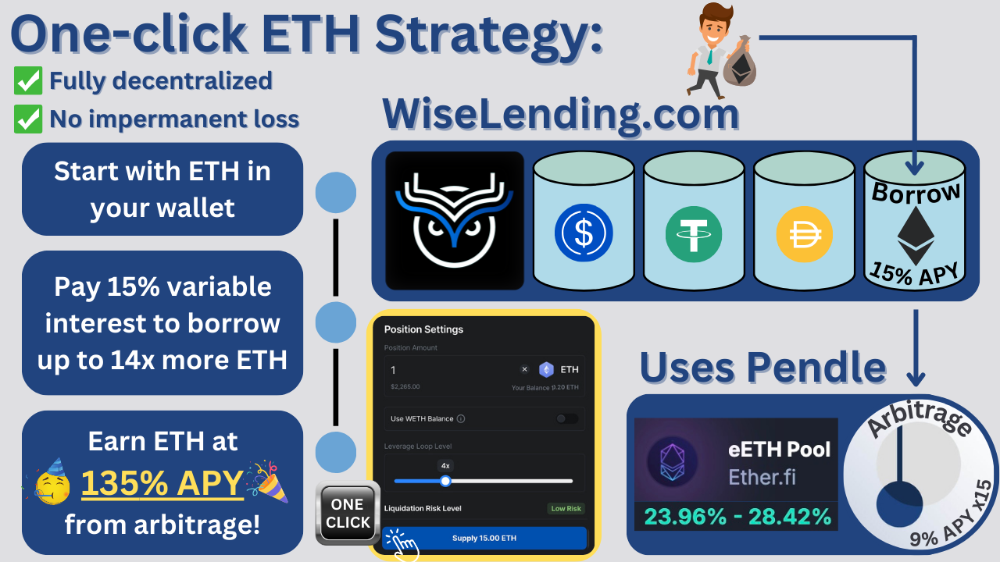
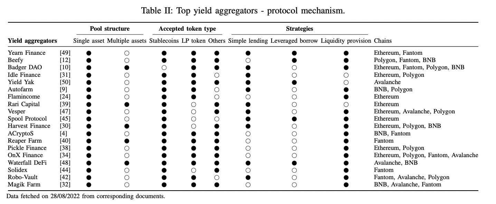

1. [💰Wise Lending](/wise/wise-lending)

# 🤑Power Farms

One-click yield-farming strategies that leverage native liquidity from our lending platform to multiply the yields available on select Pendle zero-impermanent-loss LPs.

### What Role do Power Farms play for Wise Lending?

Power Farms create a constant high demand for borrowed funds on Wise Lending, ensuring best-in-class returns for lenders. (Traditional lending platforms suffer from low borrowing demand which translates into low returns for lenders).

Power Farms Example

## Problems with Yield Aggregators:

* Lenders can't borrow against their deposited funds
* Yield is often padded with unsustainable token rewards
* Impermanent Loss makes leveraged positions very risky
* Best practices often require constant monitoring, extensive research, and the frequent rotation of funds between multiple protocols

From the chart below, one can see that Yearn Finance is one of the few yield aggregators that does simple lending, *and* leveraged borrowing, *and* liquidity provision. But even Yearn lacks the simple borrowing capabilities of Aave. **With Wise Lending, we realized that lending platforms and yield aggregators need each other to perform at their best.** Lending platforms need access to high-end yield strategies in order to increase the demand for borrowing, and yield aggregators need access to massive amounts of borrowable liquidity at a slightly less cost than their yield source, in order to create arbitrage.

Source: <https://arxiv.org/pdf/2210.04194.pdf>

* ### **Lending platforms without integrated yield sources suffer from low borrowing demand and unattractive APY for lenders.**
* ### **Yield aggregators without integrated lending platforms suffer from lack of capital, as lenders opt for more flexible options, where they can borrow against their deposits.**
* ### **Wise Lending is both a traditional lending platform, and a state-of-the-art yield aggregator, and it was built without compromising security or decentralization.**

## Why Power Farms Strategies are Safe:

In the past, yield aggregators have been regarded as risky compared to dApps like Aave, but with the rise of staked ETH as a yield source, protocols like [Pendle](https://www.pendle.finance/) have created new fully decentralized yield opportunities, without the degenerate tokenomics, unsustainable yield sources, and centralization we have seen in the past. It is only logical, that these decentralized yield sources should be used to fix the problem of low demand on traditional lending platforms.

Spok would use Power Farms

### **1) Leveraged Positions are Protected Against Liquidations**

Power Farms are zero impermanent loss, like-kind-asset, low risk strategies. Liquidations wouldn't happen from the price moving the wrong way like traditional leverage, because both collateral and borrowed assets are like-kind assets that move together. However, a black swan event that causes the derivative asset to become de-pegged from the underlying asset could cause liquidations. (e.g. the Silicon Valley Bank collapse temporarily affecting USDC).

In the unlikely event of a liquidation,only **21%** of principle funds are lost, within a few percent, depending on how quickly the position is liquidated.

The only other liquidation scenario is if the Power Farm position becomes negative APY (from the user paying more to borrow than what is being earned). For that user, liquidation may occur, if they do not close that position for an extended period of time, such that all earned profits are depleted, and enough principle is attrited away to cause a liquidation.

For this scenario to occur, it means there is most likely a better Power Farm opportunity available that is pushing the borrow demand up even further, or else there would be no reason that borrowers would pay higher APY to borrow. It's important for Power Farm users to periodically monitor their positions to ensure they are still earning positive APY. ***Note: this required attentiveness does not apply to lenders.***

### **2) Power Farms use only Decentralized Battle-Tested Yield Sources**

Since deposited capital on Wise Lending is designed to be put to work on the various yield sources available through our Power Farms, ensuring the safety and decentralization of those sources is critical to the health of Wise Lending. We will ***not*** build Power Farms on any yield systems that are compromised by centralization or unsustainable economic models.

**True DeFi** is a term that means upholding the pure decentralized ethos of DeFi. It means decentralized from end-to-end, and having no reliance whatsoever on humans, including multi-sig wallets that control critical aspects. The term "DeFi" is used to describe many projects built on the blockchain, but only a handful, including Uniswap, Curve, Pendle, and a few others are actually true DeFi projects. Supporting true DeFi is necessary, if we want to stop seeing scams like FTX and many others.

**Proxy Contracts** are smart contracts that can be changed/upgraded/altered by an admin wallet. Time locks can be implemented as a safety measure that gives users a window to exit before the new code goes live, but this is certainly **not** true DeFi. Unfortunately, the majority of blockchain projects use proxy contracts for convenience, including giants like Aave. We believe this is dangerous, and sets a bad example.

**Admin Keys** is a term referring to functions in a smart contract that are controlled by the admin. If there is any possible way for an admin to withdraw funds (either directly or by introducing new code), then it is **not** true DeFi.

For more info on decentralization, see the [Decentralization Rank](/wise/wise-lending/decentralization-rank).

### **3) Power Farms do** ***not*** **Pay out Yield in Speculative Tokens**

ETH-based Power Farms earn APY in ETH. Stable coin Power Farms earn APY in stable coins...it's that simple! We do have a WISE token, but it's not used for rewards. Wise Lending actually drives value to WISE by using its protocol fees to buy-and-burn WISE. (This is the opposite of the trend, which is using a hyper-inflationary token to drive users to the platform). See [WISE Token](/wise/wise-token).

### 4) Power Farms are Scalable and Sustainable

Power Farms are scalable, as long as their yield sources do not not become diluted. Since Power Farms are built on the most powerful yield sources in crypto such as staked ETH, Wise Lending can support billions in capital without becoming diluted.

[PreviousWise Lending](/wise/wise-lending)[NextPendle Strategies](/wise/wise-lending/pendle-strategies)

Last updated 9 months ago