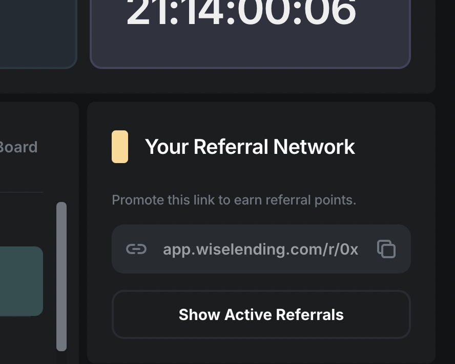
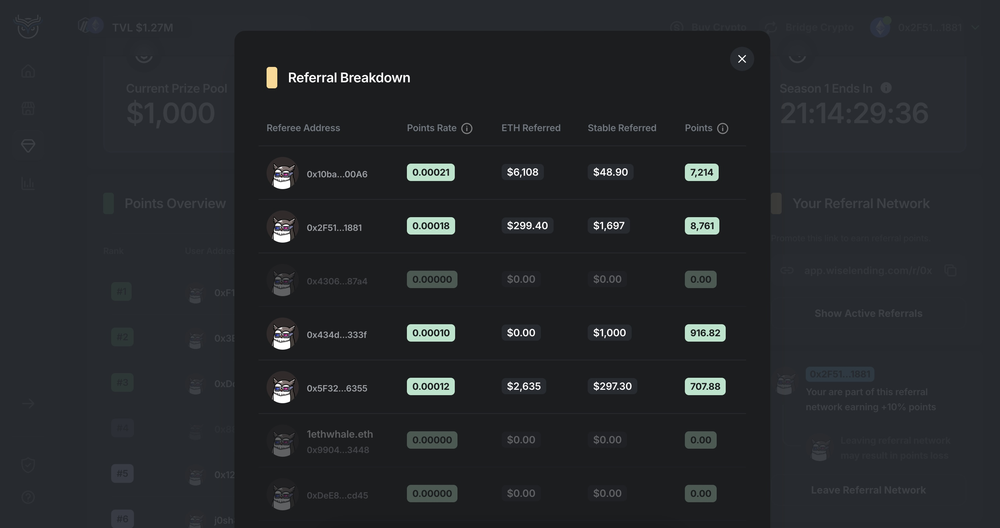

1. [💰Wise Lending](/wise/wise-lending)

# 🔁Referral System

## No Personal Information Needed!

Our referral system is open-source and on-chain. Promoters can start growing their network by sharing a referral link, which has their unique 0x wallet address. Promoters can use an ENS to make their link more recognizable to their referees.

### Tracking Referrals

The info for your referral network can be seen in a widget on the right side of the screen. In that box you have a link to copy and share. Your friends and family will need to visit your link, connect their crypto wallet, and sign a message to join your network (no gas needed). Everyone should join a referral network because both the referrer and the referee get 10% extra points for participating.

Click here to Copy your unique Referral Link

To view your current network, click the "Show Active Referrals" button and you will see your Referral Breakdown.

Click "Referral Breakdown"

Remember, it's not about the number of referrals, but about the amount of funds each one of your referrals deposits into Wise Lending. More funds deposited will earn you more points, so be sure to follow up and assist your referees with any questions they have about Wise Lending or any help they need in depositing funds.

It doesn't matter which blockchain is used for depositing funds (Ethereum, Arbitrum, Base). The same amount of funds will earn the same amount of points on either blockchain.

[PreviousLeaderboards](/wise/wise-lending/leaderboards)[NextDecentralization Rank](/wise/wise-lending/decentralization-rank)

Last updated 4 months ago