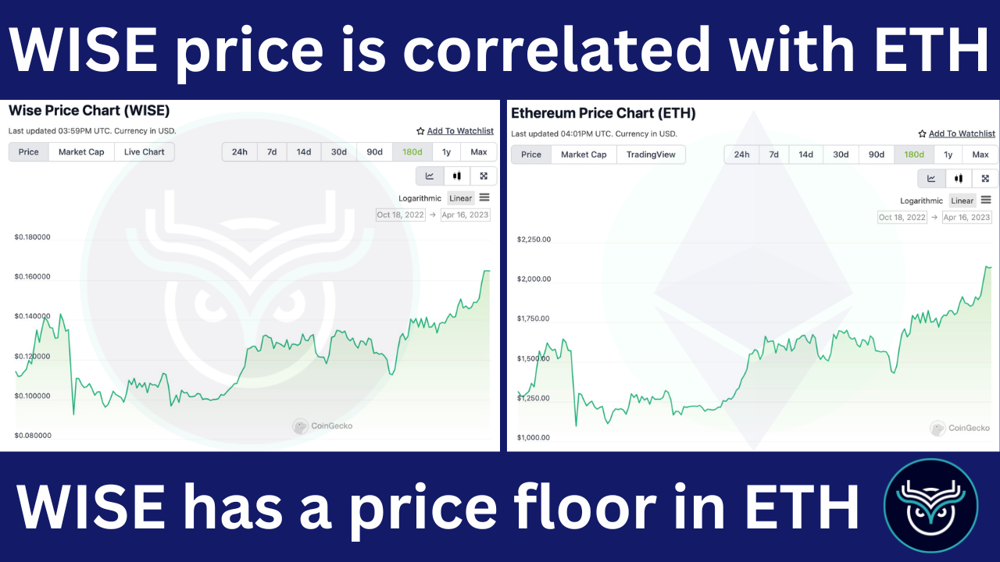
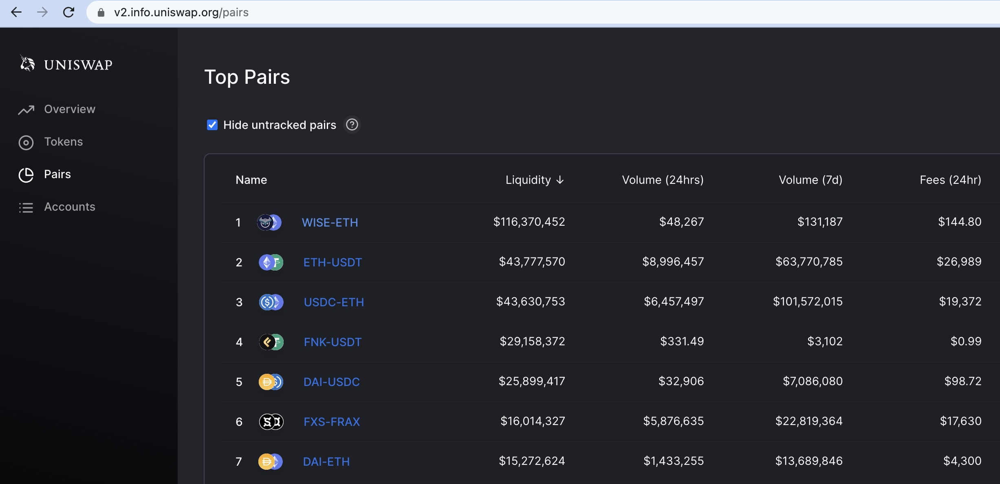

# 🪙WISE Token

WISE is the reserve token of our ecosystem, and our massive WISE/ETH liquidity pool on Uniswap allows others to pair their token with WISE yet still swap out of their token into ETH seamlessly.

## WISE TGE History:

WISE was launched in Nov-Dec 2020 using a fair and open [auction event that raised 57,900 ETH](https://legacy.wisetoken.net/reservations) in token sales. The ETH wasn't used for development, but instead to create a massive WISE/ETH trading pair on Uniswap, which was then [locked by burning the LP ownership tokens](https://etherscan.io/token/0x21b8065d10f73ee2e260e5b47d3344d3ced7596e#balances). This established a price floor in ETH, and created a deep and permanent liquidity pool for buying or selling WISE.

Traditional tokens create massive inflation that funds airdrops and/or pads APY on DeFI platforms to attract users and grow TVL. This has been a wildly successful way to bootstrap new users in the short term, but it always comes at great future economic cost. **WISE does not have whale wallets or hyper-inflation, and we're happy to build growth slowly and organically**.

## WISE is the Reserve token of our Ecosystem:

* **Highly Liquid -** WISE needed deep liquidity in order to be attractive to hold vs ETH, so that price slippage is not a factor. [Check the WISE liquidity](https://v2.info.uniswap.org/pair/0x21b8065d10f73ee2e260e5b47d3344d3ced7596e).
* **Decentralized/Well-distributed -** Most tokens have large team treasuries and insider allocations, but WISE's 100% fair launch created a fully diluted and well dispersed supply. [No one owns more than 5% of the WISE supply](https://etherscan.io/token/0x66a0f676479Cee1d7373f3DC2e2952778BfF5bd6#balances).
* **Correlated with the price of ETH** - WISE is naturally correlated with the price of ETH because of our large [WISE/ETH liquidity pair on Uniswap](https://v2.info.uniswap.org/pair/0x21b8065d10f73ee2e260e5b47d3344d3ced7596e).
* **Appreciating vs ETH** - Being correlated with ETH provides a strong baseline value in ETH, but the possibility to appreciate vs. ETH comes from the revenue on Wise Lending, which is used to buy-and-burn WISE off Uniswap.

WISE and ETH

As revenue on Wise Lending increases, we expect other projects to recognize the value, and change their liquidity pairings from ETH pairs to WISE pairs, creating instant jumps in the value of WISE (in addition to the buy-and-burns). Any project that pairs their token with WISE instead of ETH will naturally benefit from the steady growth of WISE vs. ETH.

## Yes, We Really Have Massive Liquidity!

Top pairs on Uniswap V2

## The Vision for WISE in the words of our Founder:

*"First we gathered a pile of Ether from the community and merged it with WISE token via an ownerless Uniswap liquidity pool. Pairing our token with an un-ruggable pool of ETH ensured that, at the very least, WISE is supported by the ETH value in our pool. Then we got to work on our revenue-earning crypto apps that are designed to consistently buy-and-burn WISE.
Once WISE is appreciating versus ETH, many projects will want to pair their token with WISE instead of ETH to piggy-back off our revenue streams. This is a really important catalyst for exponential growth in WISE.
No traditional company can follow in our footsteps, because companies are not designed to build things they don't own or benefit from directly. By creating the Wise Ecosystem to efficiently reward users without gifting a slice of it to myself, we have eliminated any possible competition, because there is no arbitrage to be gained from relaunching the system. Instead, projects will simply join us by pairing their liquidity with WISE."* Peter Girr

[PreviousWorld Mobile](/wise/world-mobile)[NextStaking WISE](/wise/wise-token/staking-wise)

Last updated 9 months ago