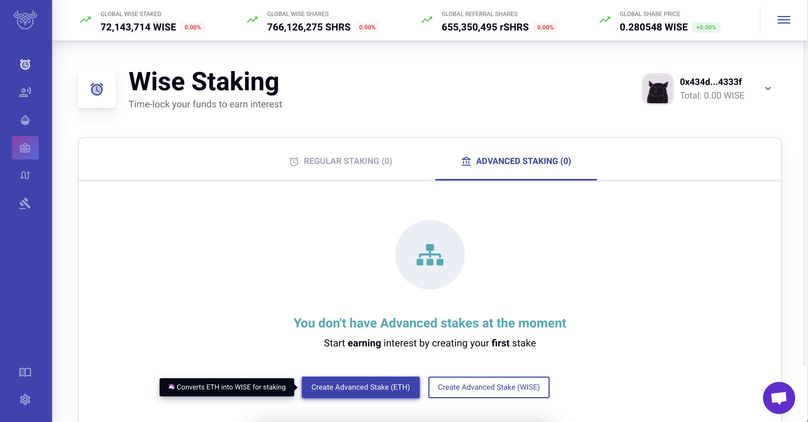
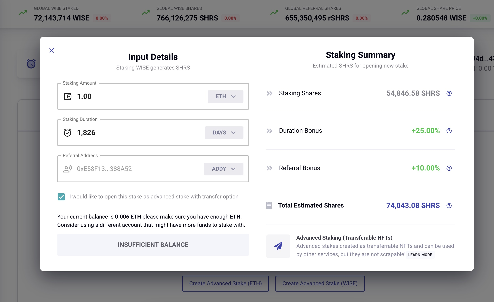
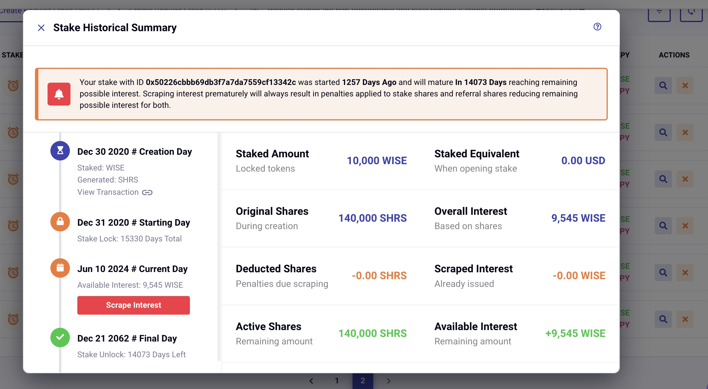
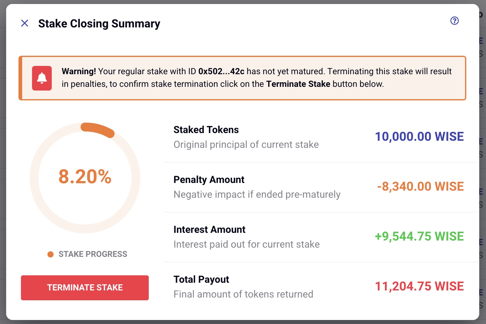

1. [🪙WISE Token](/wise/wise-token)

# 🥩Staking WISE

## How to Create WISE stakes:

WISE stakers are rewarded for making WISE more scarce by locking it up. Staking rewards are funded with 75% of the annual WISE inflation (25% funds referrals). Unstaking WISE early is penalized, so staking WISE creates a supply shock and a predictable future price floor.

To start a stake, go to <https://app.wisetoken.net/staking> and select the "regular" or "advanced" staking tab. Advanced stakes are recommended since they are bonded to an NFT that that can be sold, transferred, or borrowed against later on. The max length for an advanced stake is 10 years, so if you wish to stake for 11-42 years, then create a regular stake. Either way, you can use our easy button seen below to start a stake using ETH or WISE already in your wallet.

starting a WISE stake

Input the amount of ETH or WISE you wish to use for your stake (ETH will be converted to WISE for the stake if you select that option). Then input the desired stake length in days. On the right you will see two ways to increase the amount of shares on your stake. Shares directly affect the APY you will earn on your stake, so it is best to get all the bonuses you can. You gain an extra flat 10% APY from using a referral link (you can select "Wise team referral" in the referral section if you need one). Select "cookie referral addy" instead if you have used a link from a friend.

finalizing your WISE stake

The other way to increase your shares is to stake for a longer period of time. You can get an extra 5% bonus shares for every year you stake up to 25% for 5 years. A 10 year stake will earn significantly more than two back-to-back 5 year stakes, because you get to keep your original share price for double the time. Since share rate increases every time someone closes a stake, this will add up to significantly more APY over the final 5 years.

**HIGH Gas costs for starting/ending stakes:**Our shares system and referral rewards make our staking contract much more complicated than a simple lock-up. Ending a stake costs much more than a simple swap, and the cost grows with the length of the stake. Holders must monitor Ethereum gas prices, start and end stakes during periods of low gas demand, and stake larger amounts ($5000+ for example).

## Scraping interest on WISE stakes:

The interest earned on WISE stakes can be collected at any time by scraping. This does not affect the principal amount of staked WISE, but it does reset the shares amount of the stake, meaning the shares advantage for staking earlier is reset as if the stake was started on the day you scrape. This will cause a significant reduction in APY for the remainder of your stake, so scraping is not recommended unless the stake is nearing maturity. Subsequent scrapes do cost significantly less gas, and closing scraped stakes will cost slightly reduce gas fees.

scraping WISE stakes

To scrape, click the magnifying glass on the right hand side of your stake, then scroll down on the left hand side of the pop-up to find the button to scrape the interest on your stake.

## Ending a WISE Stake Before Maturity:

You can end your stake any time before maturity for a significant penalty. The penalty is equivalent to the percentage of time you have not completed on your stake. For example a 100 day stake ended on day 30 will cost 70% of your principal to end. The penalized WISE is distributed proportionally among the remaining WISE stakers. Interest earned on stakes is never penalized.

Early End Staking

To end your stake, click the orange X on the right hand side of your stake, and then click the "TERMINATE STAKE" button on the pop-up.

[PreviousWISE Token](/wise/wise-token)[NextWISE referrals](/wise/wise-token/wise-referrals)

Last updated 9 months ago