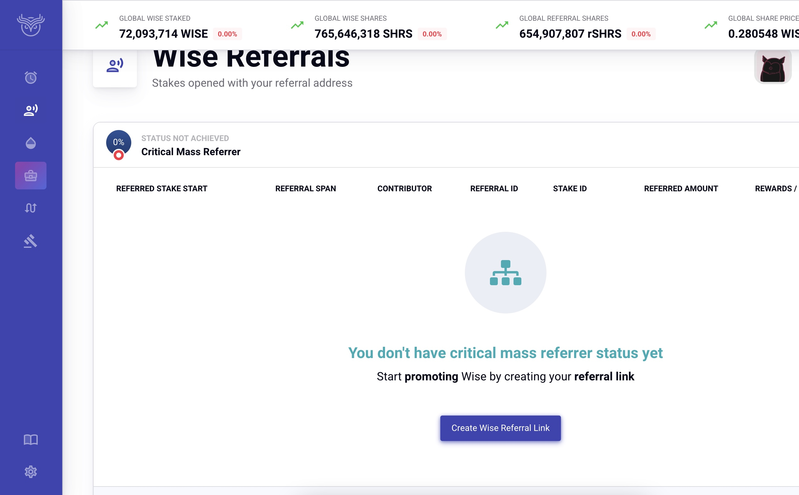
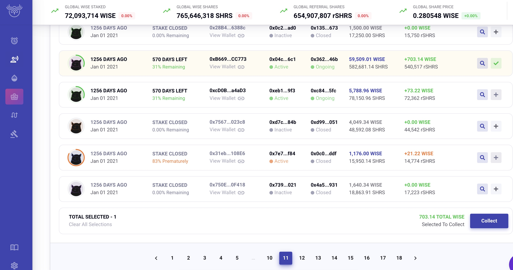

1. [🪙WISE Token](/wise/wise-token)

# 🗣️WISE referrals

The WISE referral system is funded using 25% of WISE inflation (75% goes to stakers). In order to start earning referrals you must first become a "Critical Mass Referrer".

## Critical Mass Referrer:

You must refer $10,000 USD of WISE stakes in order to become a CMR and start earning WISE from referrals. The USD amount is calculated on the day each stake is created. Any stakes started while building up $10k of WISE stakes do not retroactively start earning referral rewards after you achieve CMR status, so it is best to have your first referree stake at least $10k in USD value. You can self refer by using another wallet address, but since there is a $10k requirement for CME, your friends and family members staking less than $10k should use your referral link.

## Creating a Referral link:

You can create a referral link by visiting <https://app.wisetoken.net/refer> and clicking the button to create a link or by editing this link here with your wallet address: https://wisetoken.net/?w=YOUR_ADDRESS_HERE

creating a referral link

Anyone clicking your link will have a cookie stored in their browser that credits any stakes they create under your referral link. You only earn rewards from direct referrals (WISE is not a MLM model).

## Scraping Referral Interest:

After reaching CMR status, you will see your referred stakes start showing up in your referral tab. You can scrape the referral interest earned off these stakes whenever you want without penalty. Subsequent scrapings of the same stake cost significantly less gas. When your referee's stake matures, or if they early end stake, you will stop earning referral interest on that stake.

scraping referral stakes

Click the + sign on the right side of your referral stakes to select the ones you wish to scrape, then click the "collect" button at the bottom when ready.

[PreviousStaking WISE](/wise/wise-token/staking-wise)[NextWiseR Token](/wise/wiser-token)

Last updated 9 months ago