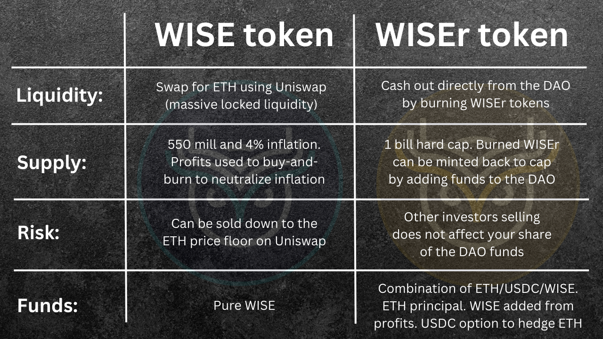

# 🪙WiseR Token

WiseR is a special and very scarce VIP token for the WISE community that gets boosted APY, airdrops, and that can be burnt to claim a portion of DAO funds.

## WiseR TGE History:

The WiseR token sale was a 50 day long auction event (Mar-Apr 2023) that distributed the DAO tokens (WiseR) to investors. A total of 1152 ETH was raised and forwarded to the DAO contract, forming the initial principal value for the WISEr token.

## WiseR 1 Billion Supply Hard Cap:

* **900 million** for the auction (18m/1.8% per day for 50 days)
* **90 million** for referrals (10% commission on auction purchases)
* **10 million** for misc. (marketing, special airdrops. VIP perks)

## WiseR ongoing Value and Earnings:

Since DAO funds are deposited into the ETH pool on Wise Lending, holding WiseR is similar to holding ETH that is deposited on Wise Lending. However, WiseR holders earn 10% of protocol fees on top of the regular lending APY in our ETH pool. WiseR will not go down in crypto value, since others claiming their share of the DAO funds does not diminish your share. (ex: if your share of the DAO is 1.5 ETH then it will always be at least 1.5 ETH no matter who sells/burns)

## Redeeming: (Burning WiseR to cash out)

Users may redeem their share of total funds from the WiseR smart contract ([here](https://app.wisetoken.net/wiser)), which includes the initial auction funds, interest earned from borrowers, and protocol fees from Wise Lending.

* **100% of the redeemed WiseR is burned from supply.**
* **The % of WiseR supply burned equals the % of total funds claimed. (E.g. burn 1% of WiseR total supply to redeem 1% of funds in the contract from each bucket ETH/USDC/etc.)**
* **As long as WiseR is held without being burnt, it is earning borrowing fees and platform fees which are constantly being added to the DAO contract.**

## Minting WiseR:

WiseR will never have more than 1 billion supply, however, after people burn some WiseR, it creates the opportunity for someone to add more funds to the contract and mint new WiseR, until the supply cap is reached again.

* **WiseR can only be minted up to 1 billion total supply**
* **Minters must add the proportional value to the contract + a fee**

There is an additional fee for minting WiseR after the auction. This allows new investors to purchase a WiseR position in what may otherwise be an illiquid buyers market. (Although the sellers are always liquid via the DAO contract).

The Wise admin can swap ETH in the DAO for USDC and vice versa. This function is mainly there to preserve the value of the treasury during major market highs and only with the consensus of the DAO. This function is meant to be used sparingly (not to day trade). Funds cannot be removed from the treasury except to deposit on Wise Lending.
Any WiseR holder who is in the minority vote and do not agree with the swapping of DAO funds between ETH/USDC can simply exit the DAO by burning WiseR and collecting their share of funds without penalty.

## WiseR Governance

We use snapshot.org to vote on relevant topics concerning WiseR.

## The difference between WISE and WiseR:

**WISE** is the reserve token of the ecosystem. It is what we use instead of ETH as a store of value. WISE holders may stake WISE to earn higher APY than staking ETH on an asset that is correlated in price with ETH and yet can go up vs ETH.

**WiseR** is the governance token for the DAO, and it represents a share of the pooled ETH, WISE, and USDC in the DAO treasury. WiseR holders can burn their tokens to collect their share of funds from the DAO.

WISE vs WISEr

[PreviousWISE referrals](/wise/wise-token/wise-referrals)[NextFundraising](/wise/fundraising)

Last updated 9 months ago