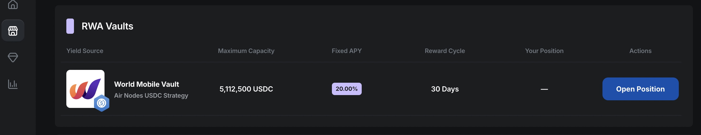
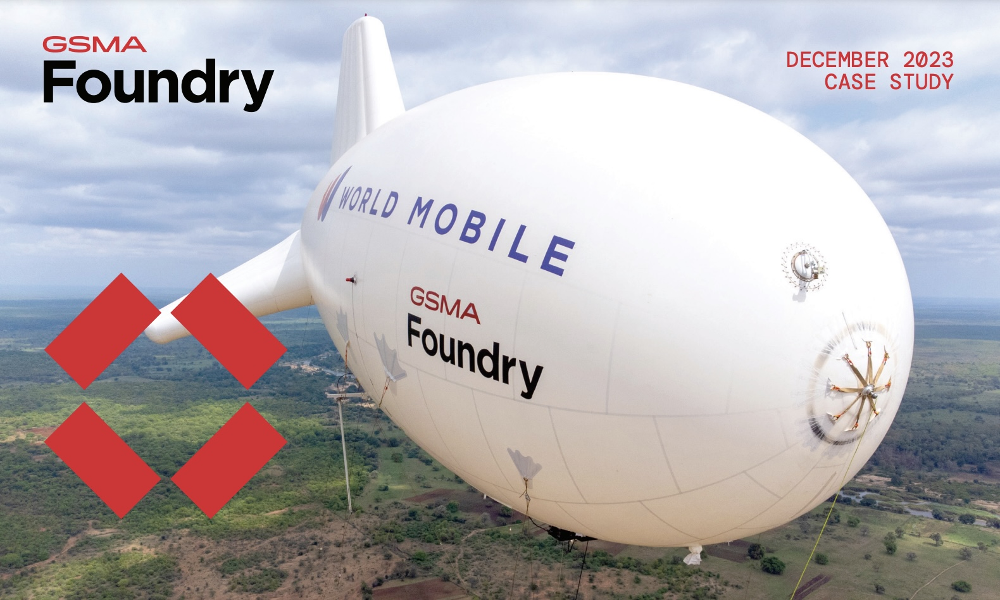

# 📶World Mobile

World Mobile is a mobile internet provider company that utilizes innovative technology to connect the unconnected people of the world. They have a sharing-economy business model and excellent revenue, and we have partnered with WM to bring their yield opportunity to our platform in the form of a 20% fixed APY vault for USDC.

World Mobile Vault on Wise Lending

## How it Works:

To start earning 20% fixed APY on USDC, navigate to the [farming page](https://app.wiselending.com/farming) on Wise Lending, connect your browser wallet, and deposit USDC from your wallet. This will take ***two*** transactions, one for approval and one for depositing.

Note: Only 1 USDC deposit per wallet address is supported at this time.

The World Mobile vault is CAPPED at $5M! Due to the incredible rate of fixed returns, it's advisable to quickly secure your position in the vault while there is still room available. The vault cap can only expand as fast as World Mobile.

### Claiming Interest:

Interest is claimable every 30 days after you have deposited your USDC principal, Use the blue button in the same place as you deposited to claim your interest.

### Liquidating Principal:

Your USDC principal ***cannot*** be withdrawn, since it was used to purchase node infrastructure for the mobile network, however, you may sell your position in the vault on the secondary market. When you deposit USDC in the vault, you also mint an NFT to your wallet that represents your position. This NFT is required for claiming interest on your position. We do not anticipate liquidity being an issue since nodes have been trading above the purchase price due to high APY. The Wise team will personally assist as necessary any users wishing to exit their position in the vault.

### How Safe is the Vault from Attacks?

Our World Mobile vault automatically forwards all USDC deposits directly to World Mobile, who use those funds to buy nodes to build their internet network. There are no principal funds sitting in the vault that could be attacked. Additionally, the node infrastructure is insured as part of the cost for the nodes, and any maintenance is handled entirely by World Mobile. Users can be assured that once they deposit USDC, they can count on a passive yield source that requires no maintenance and very little risk. The revenue coming back from World Mobile every month is placed back in the vault for users to claim, and users can avoid the (unlikely) possibility of an attacker finding an exploit to steal the incoming revenue by promptly claiming their interest from the vault every month.

## About World Mobile

Like Airbnb for hotels and Uber for taxis, World Mobile has applied the sharing economy model to internet carrier companies. But that's not all they have done, because they've actually developed a breakthrough in the technology too. World Mobile networks are 8x cheaper and can be set up much faster than conventional methods.

### A Technological Breakthrough:

World Mobile has taken a different approach to building the infrastructure for providing internet. The conventional way has been building cell towers, but World Mobile utilizes aerostats (blimps). To accomplish the same work as 12 cell phone towers do, World Mobile launches a 75-foot tethered blimp in the sky that carries the radio transmitters. The blimp beams connectivity down to air nodes on rooftops to provide internet to households and cell phones. This method is 8 times cheaper than the competition, and they are also constantly finding ways to improve the cost even more. [Here](https://www.gsma.com/get-involved/gsma-foundry/wp-content/uploads/2023/12/New-Coverage-Takes-to-the-Skies-b-FINAL.pdf) is the most recent study about this technology.

World Mobile Aerostat Technology

### Sustainable and Recession-Proof Yield:

In modern society, internet connectivity has become a need, not a want. We depend on it for everything from our jobs, to transportation, to communication, and many other aspects of our lives. People are willing to pay for internet connectivity as much as they are willing to pay for food and housing. For this reason, World Mobile's revenue model is extremely reliable and recession-proof. First of all, they are cheaper than conventional options, with people in developing areas of the world paying less than $2 per month for internet, and each plan is a rolling 1 year contract. This is why we are able to offer 20% fixed yield. If anything, we might be able to ***increase*** the fixed APY amount as World Mobile becomes more efficient!

### Can the APY ever change?

This yield comes directly from World Mobile, and customers are on rolling annual contracts, meaning revenue is secured for the foreseeable future, and there would be 1 year of early warning before that could change. World Mobile found a way to build their infrastructure 8x cheaper than conventional methods, and it is very unlikely that legacy companies will rush to adapt. World Mobile has made a name for themselves, and have become a trusted partner with every network they have launched. We believe they will to continue to offer high APY for decades to come.

The Wise team's commitment is to maintain 20% fixed APY as long as World Mobile keeps delivering that value, and that we will maintain the liquidity of the USDC vault deposits, by selling nodes as necessary, if users are unable to sell their vault positions on the secondary market.

### How Big is the Market?

World Mobile shines brightest in places of the world that are considered developing or emerging, due to their innovative way of erecting networks. What may surprise you is that over 30% of the world fits this category! And because of the efficient way they do things, World Mobile can provide competitive alternatives anywhere you can fly their aerostats, which is most places. World Mobile is already active in the USA in places such as Reno, NV which struggle to find connectivity from conventional carriers. Indeed, the bottleneck for growth is actually regulatory and compliance red tape, rather than their capability to keep building. World Mobile has the potential to be the largest internet carrier in the world.

### The Starlink Question:

One of the most common questions that comes up about World Mobile is if Starlink competes with or if they could render World Mobile obsolete. *Nothing could be further from the truth!* In fact, Startlink is complementary to World Mobile, since Starlink nodes are used on World Mobile aerostats. What's important to understand here is that internet satellites have a very different capability and role than terrestrial internet infrastructure, and this is not likely to change in the future simply because of physics. There is a big difference between satellites that are capable of providing coverage for emergency calls in rural areas, and being able to provide a powerful internet connection capable of streaming at high bandwidth to thousands of people in close proximity. The latter is best accomplished with infrastructure on the ground, like what World Mobile is doing. Satellites simply do not have that capability due to physics issues like "beam contention" and the fact that it's very expensive. World Mobile is able to provide high bandwidth internet to people in developing areas of the world for under $2 per month.

Watch our video about World Mobile

[PreviousLASA AI](/wise/wise-lending/lasa-ai)[NextWISE Token](/wise/wise-token)

Last updated 2 months ago